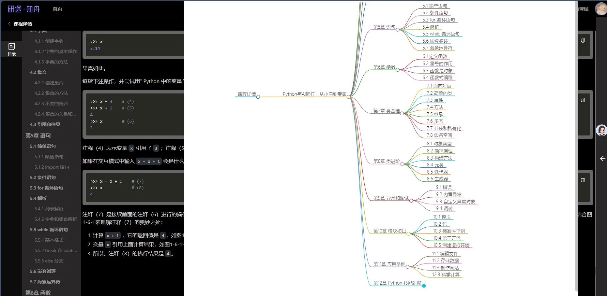

# 思维导图生成器 Chrome 扩展

## 概述

思维导图生成器是一款Chrome扩展程序，允许用户使用OpenAI的语言模型从网页内容生成思维导图。此工具特别适用于将文章、博客或任何网页内容总结为结构化的思维导图格式。

## 功能

- **API 配置**：可以直接从扩展的弹出窗口轻松配置您的OpenAI API Key、Base URL和模型。
- **动态模型选择**：选择您想要用于生成思维导图的模型。
- **内容提取**：自动从当前网页提取并清理内容。
- **思维导图生成**：使用指定的OpenAI模型生成Markdown格式的思维导图。

## 效果展示



## 安装

1. **克隆仓库**：
   ```bash
   git clone https://github.com/MRZHUH/mind-map-generator-yanxue.git
   ```

2. **在Chrome中加载扩展**：
   - 打开Chrome并导航到 `chrome://extensions/`。
   - 在右上角启用“开发者模式”。
   - 点击“加载已解压的扩展程序”，然后选择您克隆的仓库目录。

## 使用方法

1. **配置API设置**：
   - 点击Chrome工具栏中的扩展图标以打开弹出窗口。
   - 输入您的OpenAI API Key、Base URL，并选择所需的模型。
   - 点击“保存设置”以存储您的配置。

2. **生成思维导图**：
   - 导航到您想要总结的网页。
   - 点击扩展弹出窗口中的“生成思维导图”按钮。
   - 扩展将提取内容，发送到OpenAI API，并显示生成的思维导图。

## 要求

- **Chrome浏览器**：确保您安装了最新版本的Chrome。
- **OpenAI API Key**：您需要一个活跃的OpenAI账户和API密钥来使用此扩展。

## 故障排除

- **API错误**：确保您的API Key和Base URL正确。检查您的OpenAI账户是否有任何问题。
- **内容未提取**：扩展会寻找常见的内容容器，如 `<article>`、`<main>` 或 `.content`。如果页面结构不同，提取可能会失败。

## 贡献

欢迎贡献！请fork该仓库并提交pull request以进行任何改进或错误修复。

## 许可证

此项目根据MIT许可证授权。详情请参阅 [LICENSE](LICENSE) 文件。

## 联系方式

如有任何问题或反馈，请联系 [bond@funcd.org](mailto:bond@funcd.org)。